# Aprendiendo Kotlin - Parte I

Este proyecto cuenta con 5 aplicaciones que implementan fundamentos básicos e intermedios del desarrollo android con Kotlin.
Estas aplicaciones fueron desarrolladas con base en ideas propuestas por el curso de Kotlin desde 0 de **aristidevs** y cosecha propia:

-   [Curso de Kotlin desde 0 - Parte 1](https://www.youtube.com/watch?v=vJapzH_46a8)
-   [Curso de Kotlin desde 0 - Parte 2](https://www.youtube.com/watch?v=ndqIqh6joGA)

## Herramientas utilizadas 🛠️

-   Kotlin.
-   Android Studio.
-   Gradle con Groovy.
-   Librerías:
    -   Retrofit
    -   Picasso
    -   DataStore

## Conceptos aplicados 📙

-   Kotlin fundamental (variables, condicionales, bucles, arrays, nulabilidad, etc).
-   POO (classes, atributes, encapsulamiento, companion objects, herencia, implementación de interfaces, etc).
-   Programación Funcional.
-   Navegación entre activities.
-   Recycler views.
-   Gestión de layouts (ConstraintLayout, LinearLayout y FrameLayout).
-   Dialogs.
-   Controles de formulario (View, TextView, EditText, RangeSlider, SearchView, Button, FloatingActionButton, CardView, ImageView).
-   Reutilización de estilos.
-   Renderizado dinámico de views.
-   Peticiones http.
-   Persistencia de datos para configuraciones.
-   Implementación del modo oscuro.

## Aplicaciones 💻

### Counter 1️⃣2️⃣3️⃣

Aplicación que muestra un número en pantalla que se puede incrementar o decrementar de 1 en 1 con 2 botones.

    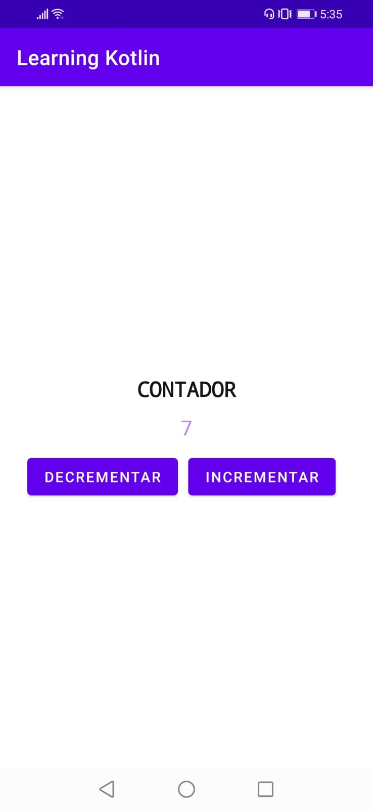
    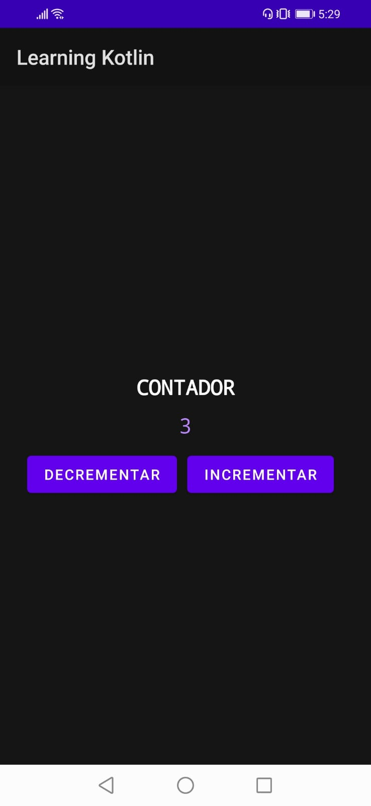

### IMC 🚑

Aplicación que calcula el índice de masa corporal (IMC).

<section style="display: flex; flex-direction: column; gap: 15px" align="center">
    

        
        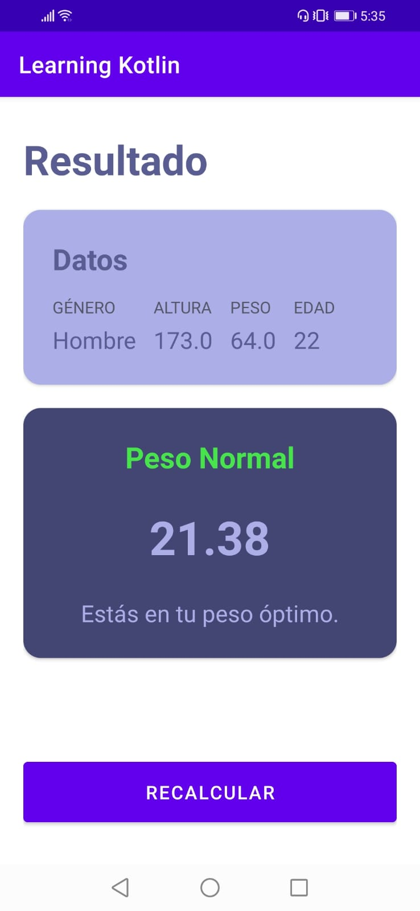
    

    

        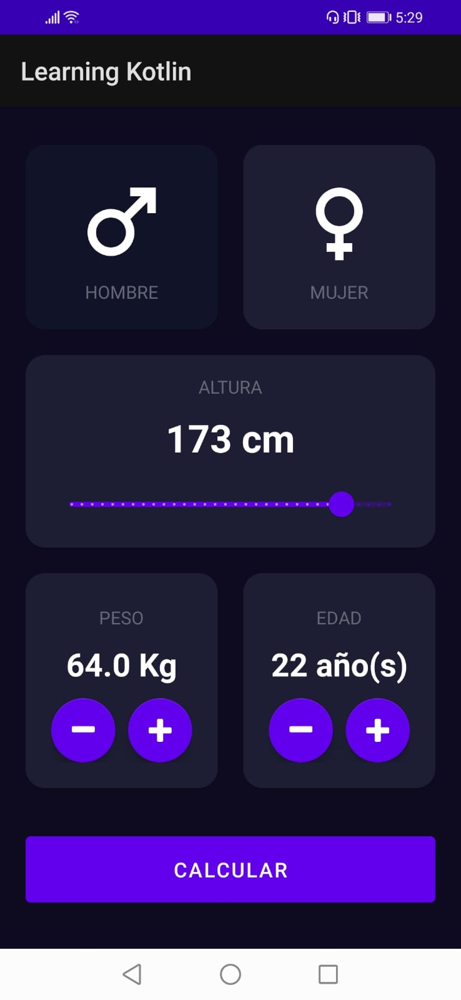
        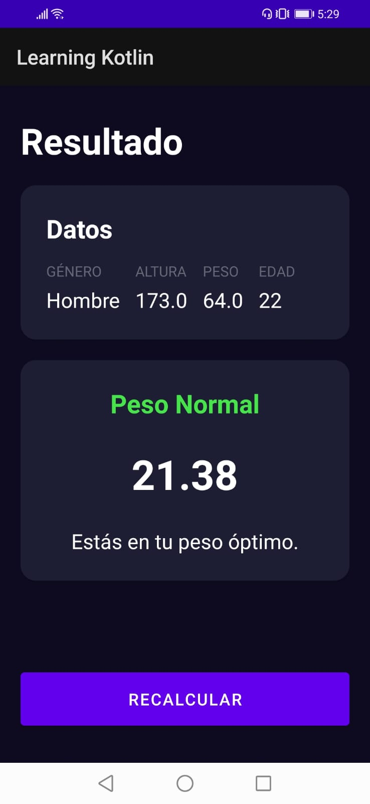
    

</section>

### Todo App 📝

Aplicación para crear, visualizar y chequear tareas por hacer por categoría.

    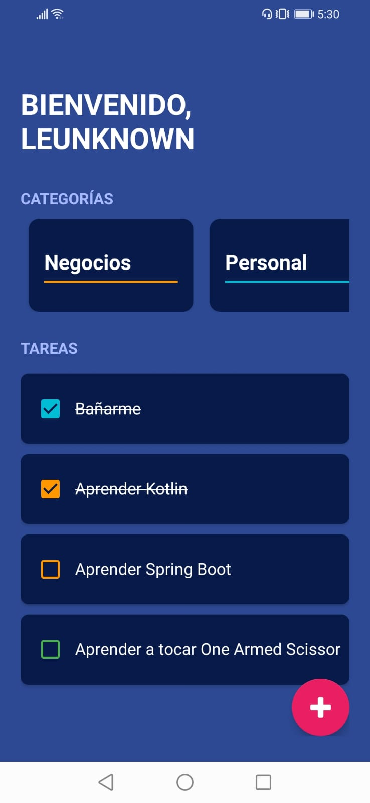
    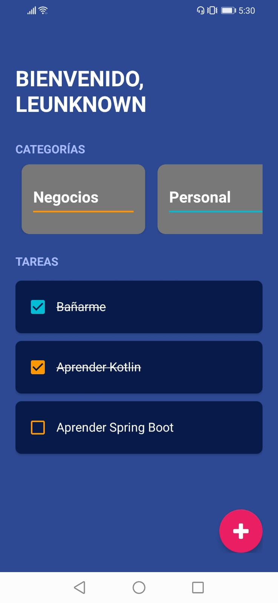
    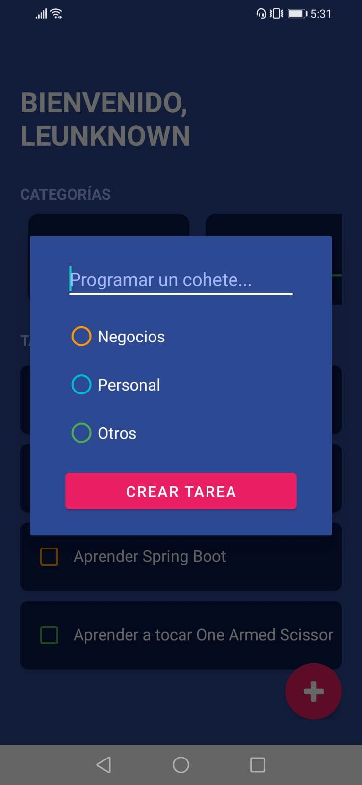
    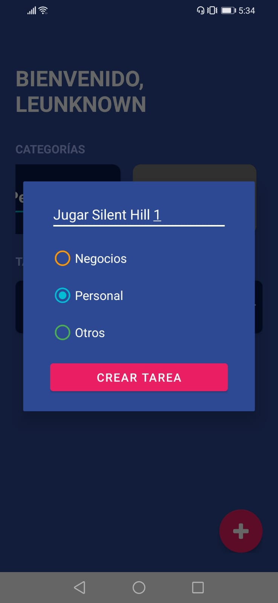
    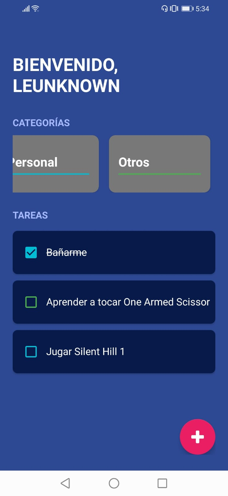

### Superhero App 🐉

Aplicación de búsqueda de superhéroes que consume una API libre en internet.

<section style="display: flex; flex-direction: column; gap: 15px" align="center">
    

        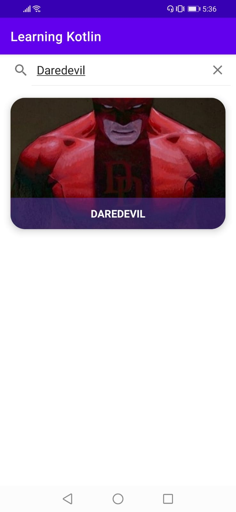
    

    

        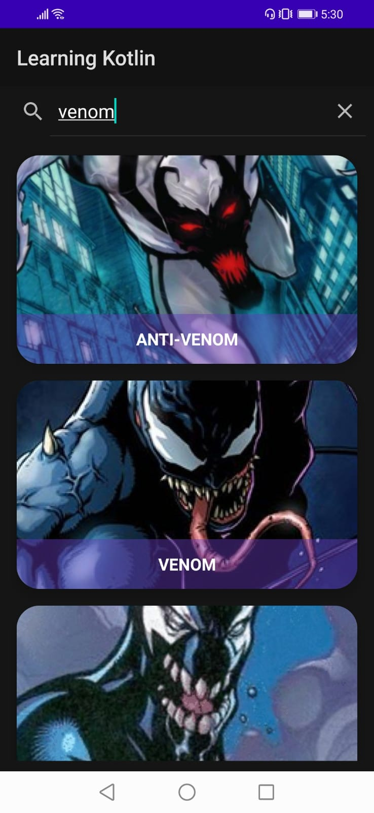
        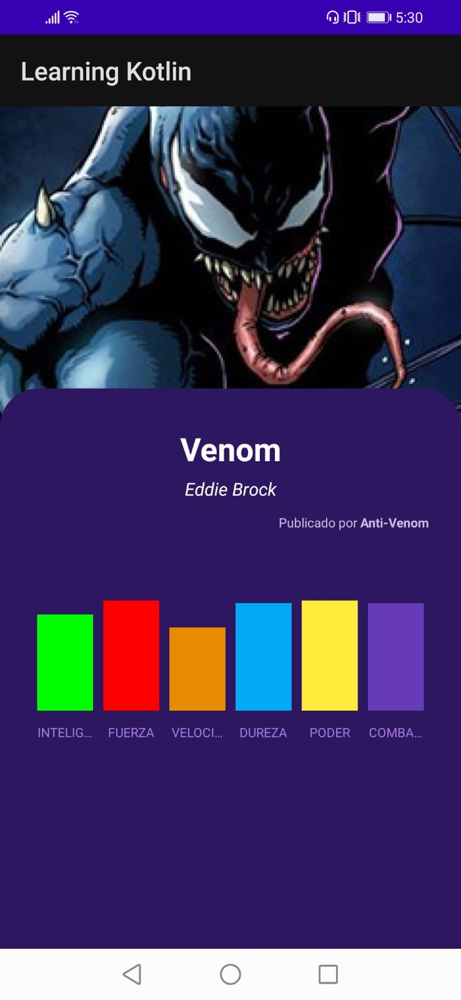
    

</section>

### Settings ⚙️

Aplicación de lista de opciones de configuración que puede persisitir (solo el **modo oscuro produce efectos**).

<section style="display: flex; justify-content: center; gap: 15px" align="center">
    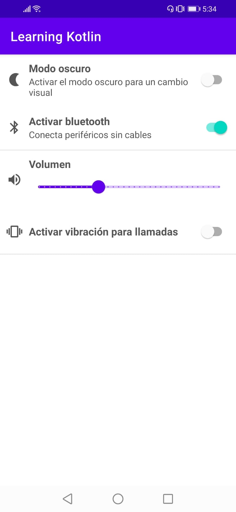
    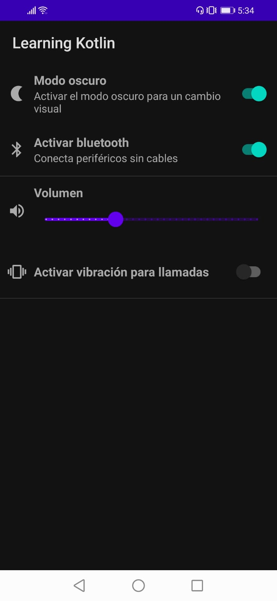
</section>
